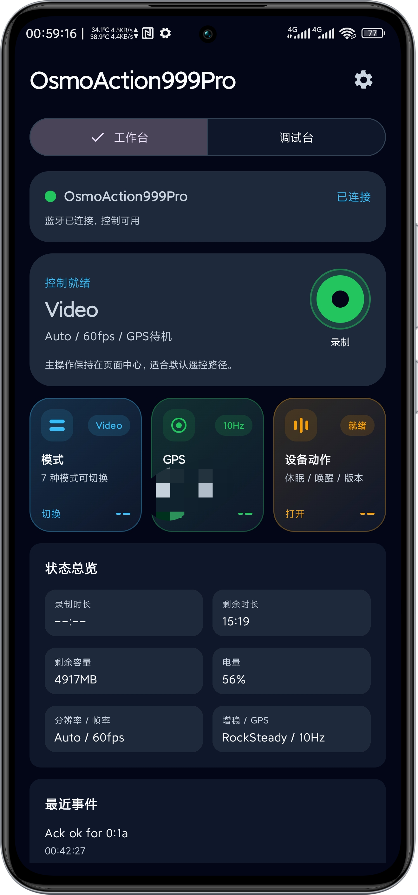
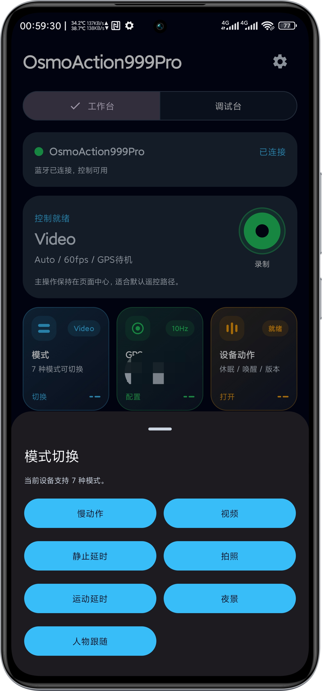
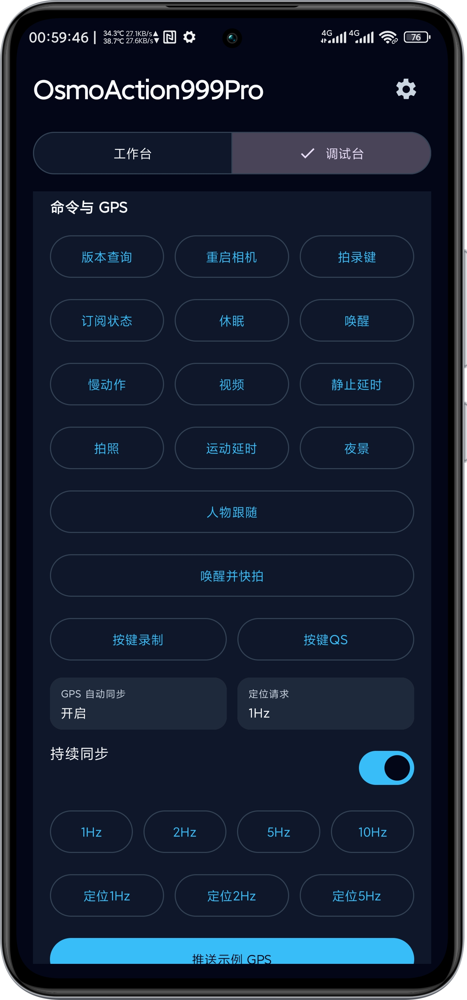

# 欧思魔控 (osmoControl)

[GitHub 仓库](https://github.com/AlliotTech/osmoControl)

## 界面预览

| 工作台 | 模式切换 | 调试台 |
| --- | --- | --- |
|  |  |  |

## 项目简介

欧思魔控（osmoControl）是一个面向 Osmo 设备的 Android 控制 Demo，目标是用手机替代硬件蓝牙遥控器的绝大部分常用功能，便于演示、联调和功能验证。

项目除了覆盖基础蓝牙控制能力外，还支持将手机侧 GPS 数据上报到设备链路中，用于定位信息嵌入视频或相关素材流程的验证。

## 核心能力

- 扫描并连接 Osmo 设备，完成蓝牙会话建立
- 替代硬件蓝牙遥控器的大部分常用控制能力
- 支持录像控制、拍摄触发、模式切换、休眠与唤醒等操作
- 支持 GPS 推送、自动同步和频率调节
- 支持调试台查看状态、日志与协议交互结果
- 支持假设备模式，便于无真机时进行界面演示和流程联调

## 适用场景

- 作为硬件蓝牙遥控器的移动端替代方案原型
- 验证相机控制链路与交互流程
- 验证 GPS 上报与视频定位信息嵌入相关能力
- 用于内部演示、测试联调和协议调试

## 说明

这是一个 Demo / 调试项目，重点在于验证控制能力与通信流程，不以消费级正式产品形态为目标。
