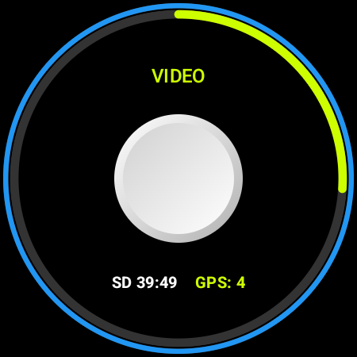

# osmoControl (Wear OS Edition)

[GitHub Repository](https://github.com/AlliotTech/osmoControl)

## UI Preview

| Main Shutter | Sleep/Wake | Settings |
| --- | --- | --- |
|  |  |  |

## Project Introduction

osmoControl (Wear OS Edition) is a smartwatch adaptation designed for Osmo cameras. The goal is to use a Wear OS smartwatch to seamlessly replace most common functions of a hardware Bluetooth remote control, right from your wrist!

In addition to basic Bluetooth control capabilities, this Wear OS project continuously pushes the smartwatch's GPS data to the camera, seamlessly embedding your location, speed, and track directly into the video telemetry—even keeping the telemetry channel alive during GPS drops.

## Core Capabilities

- **Wear OS Native**: Fully adapted for circular smartwatch displays with intuitive vertical/horizontal swipe navigation.
- **Rotary Bezel Support**: Switch between camera modes fluidly using your smartwatch's rotary crown/bezel.
- **Smart Connectivity**: Scan and connect to Osmo devices via Bluetooth with robust auto-connection management.
- **Remote Control**: Start/Stop recording, trigger the shutter, switch modes, and toggle the camera's sleep/wake states effortlessly.
- **Robust GPS Telemetry**: Real-time push of the watch's GPS data with satellite counts. Keeps the data channel active to ensure no metadata track loss during video recording.
- **Battery Status**: Dual-battery rings on the main screen to keep track of both your watch and the camera's power levels at a glance.

## Applicable Scenarios

- As a wearable, hands-free alternative to the official hardware Bluetooth remote.
- Quick control while riding, hiking, or participating in action sports.
- Reliably embed GPS route and telemetry into your action videos without carrying a phone.

## Note

This is an experimental/debugging adaptation project built for Wear OS. The focus is on validating Bluetooth control capabilities and seamless telemetry streams, but it may lack some consumer-grade polish.
